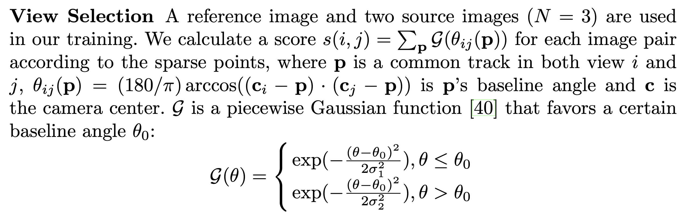

# View Selection

## Introduction

> Yao Y, Luo Z, Li S, et al. Mvsnet: Depth inference for unstructured multi-view stereo[C]//Proceedings of the European conference on computer vision (ECCV). 2018: 767-783.

This is an all-in-one view selection repository, which integrates colmap sparse reconstruction and [mvsnet](https://github.com/YoYo000/MVSNet/blob/master/mvsnet/colmap2mvsnet.py) view selection for [dtu](http://roboimagedata.compute.dtu.dk/?page_id=36) dataset together.

The intuition for this tool is to select my own specific `ref-src` pair views rather than the top-10 `pair.txt` provided by mvsnet. To be more specific, I want to generate a set of pairs between `ref=[i for i in range(49)]` and `src=[i for i in range(0, 49, 6)]`.

The principle of view selection is based on the mvsnet paper:


## Usage

### Data Preparation
You can download the common pre-processed [DTU](https://drive.google.com/file/d/1eDjh-_bxKKnEuz5h-HXS7EDJn59clx6V/view) training dataset here.

### Run COLMAP
You can use `run_colmap.py` to perform sparse reconstruction for any dtu scenes you want, here is an example for scene 1, 4, 9:
```python
python3 run_colmap.py --colmap_scene_id 1 4 9
```

### Run View Selection
After you run through the COLMAP and get the sparse reconstruction, you can use `view_selection.py` to generate your own `ref-src` pairs, here is an example:
```python
python3 view_selection.py --select_scene_id 1 4 9
```
you can modified `ref_views` and `src_views` in `view_selection.py` as your wish.

## Useful Information
+ https://github.com/colmap/colmap/issues/658, which explains the correct way to initialize SFM with an existing model;
+ https://github.com/colmap/colmap/issues/654, which explains the function of `database.db` in COLMAP;

But there is still one thing I don not fully understand: we only need to triangulate all the 3d points for current scene since we already have ground truth camera intrinsics and extrinsics, which means we just need to run `colmap point_triangulator` according to the official doc https://colmap.github.io/faq.html#register-localize-new-images-into-an-existing-reconstruction, but in fact, that's **not enough**, we can only get 2k+ points using only `colmap point_triangulator` which results in almost all zero scores when view selection.

What we need to do is actually `colmap mapper` to reconstruct a sparse model to get the correct scores as mvsnet provided, which is confusing for me because it seems the ground truth camera extrinsics are useless.